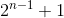
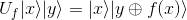
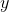
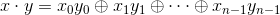
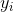

# The Deutsch Jozsa Algorithm

The Deutsch Jozsa algorithm is a really simple Quantum algorithm which can do something faster
than any classical computer can today! This page will try to explain the steps
concretely so you can see exactly **how and why it works**.

This document is similar to the [explanation in Wikipedia here](https://en.wikipedia.org/wiki/Deutsch%E2%80%93Jozsa_algorithm).
I will focus more on details which are assumed there, but you may want to read that article instead - whatever works for you!

#### Caution

Please read [the Maths of Simulating a Quantum Computer](TheMathsOfSimulatingAQuantumComputer.md) if you
are new to Quantum computing. Quantum algorithms are quite Mathematical so you will want to be
comfortable with the basics before proceeding!

## The Problem

We are given a function

which takes an `n` bit number and returns either a `0` or a `1`. We are told that the function is definitely either:

* **Balanced** - the function returns `1` for half of its inputs, and `0` for the other half.
* **Constant** - the function always returns `1` or always returns `0`.

Our goal is to determine if  is balanced or constant in time polynomial in `n`.

With a classical computer, we would need to check just over

inputs in the **absolute worst case**, as all the values could be the same for the first
 values we test even if the function were balanced
1.

However, a Quantum computer can solve this problem in polynomial time with certainty! This strongly suggests
that Quantum computers are able to solve more problems efficiently than classical computers
2.

1By choosing
 at random it is extremely
likely we will identify that  is balanced, and so could guess it is
constant if we do not see different return values quickly. This problem is actually in **Bounded error Probabilistic
Polynomial Time**, or <a href="https://en.wikipedia.org/wiki/BPP_(complexity)">BPP which you can read about here</a>. 
2 Quantum computers have not been **proven** to be more powerful
than classical computers in a complexity class sense. However, most scientists believe this to be the case. In fact,
a proof might be online since I wrote this!

## Building the Quantum Oracle

The Deutsch Jozsa algorithm relies on a "quantum" version of 
called an **Oracle**, which we will refer to as
.
Specifically, the Deutsch Jozsa algorithm requires that:

Where 
and 
and  is addition modulo two.

So 
leaves all of the first `n` **input qubits** untouched, and sets its **result** in the `n+1` qubit by adding its return
value to it modulo `2`.

#### Why this Oracle specifically?

Many classical functions **avoid modifying their input**, as this can create **unintended side effects**
if the input is reused in a future call, and in our case would seriously complicate the Maths! We are not trying to
minimise the number of qubits required here, so that decides most of the Oracle already:

So how should we set the result? Any Quantum gate needs to be a **Unitary matrix** and so needs to be **reversible**,
so trying to define it like this:

Is not possible, since the value of  is ignored.
Two inputs are mapped to the same output, which cannot be reversed, so this is not a valid Quantum gate.

The next simplest definition is to add the result to 
modulo two. This ensures:
* The result **fits in a single qubit**.
* The operation is **reversible**, since the result is uniquely determined by  and
.

We could imagine calling 
with  set to zero, and so just see the result returned. This
is roughly why this is a good definition for the Oracle, and you may see this sort of definition in other
Quantum algorithms too.

This may not reflect the thoughts that went through David Deutsch's and Richard Jozsa's minds but I hope it helped
your understanding!

#### How is the Oracle represented Mathematically?

From the reasoning above, I hope you feel confident a quantum gate exists for
,
but what does this gate look like?

We know that for any qubit state  we can write that state
as a linear combination of basis vectors. So, for `n` qubits, we could write a qubit state like this:

Where  and

for all .1 Therefore, when we apply
 to
 we can write that as follows:

What this means is that our Oracle's behaviour is completely defined by how it acts on the basis states, or in other
words, agreeing on the value of

for all  **completely and uniquely defines the Oracle**! This is great news, because we know
exactly how we want our Oracle to behave on the basis states.

For example, with `n` equal to two qubits, and  a constant function
that always returns `1`, our Oracle would be:

I've labelled the rows and columns to correspond to the basis states. For example, the column labelled `000` will act
on the basis state ,
and set it to the basis state in the row with a `1`, in this case
. This is correct,
since we have 
and  so:

You can verify some other values if you like; they should all work!

In general, any Oracle can be constructed from a classical function
in this way, where each column contains the scalars

corresponding to the **basis state decomposition of the result**. In our case,
each result is exactly a single basis state so the rows are very simple.

1This is specifically for our matrix representation, but we could
also write this in Dirac notation. This law is not specific to matrices or vectors.

## The Solution

Now we have the quantum Oracle ,
we can implement the full sequence of quantum gates for the Deutsch Jozse algorithm:

Or as a diagram copied from [Wikipedia](https://en.wikipedia.org/wiki/Deutsch%E2%80%93Jozsa_algorithm):

Measurement is performed after this in the computational basis:
* If the first `n` qubits are all zero, then  is constant.
* Otherwise,  is balanced.

To understand why this works we need to step through the algorithm.

### Step 1 - Create the Superposition

The algorithm begins with qubits initialised to

. The final qubit is 
because it avoids an extra quantum gate. Of course, it could also be
 and then we could apply
a `NOT` gate just to that qubit.

We then need to apply  to this state. The Hadamard gate
turns a 
or 
qubit into a qubit that has an equal chance of being a `0` or `1` when measured, or specifically:

</img>&nbsp;
and &nbsp; </img>

By doing this, we are preparing to apply

to all possible  at once1.

This gives us the state:

The sum on the right hand side of the equation just says that we have every possible `n` qubit basis
state included, so it relies on this equation:

You can prove this by induction if you like, but just to confirm the intuition, let's check this for two qubits:

Above I have omitted   for brevity. You will see the tensor product symbol
omitted in many equations in other documents online. Essentially, if two quantum states are next to each other,
just imagine  between them. It is very much like how we often write multiplication without the multiply symbol, so
.

Now we have the superposition prepared, we are ready to...

1With a bit of imagination anyway!

### Step 2 - Apply the Oracle

All we do here is apply z
to the state we had above and simplify. Remember that:

So applying this Quantum gate yields:

This is a good start, but we'd like to have an equation where all the qubit states are written as
 or
. Otherwise,
if we try to apply a gate to 
we will need to consider what happens when the function returns `1` and when it returns `0` which doubles
the size of the equation.

Thankfully, we can simplify this further by considering the two cases right now:

 
If you are struggling to follow line 4, note that many of the terms of each sum are zero.

Phew! That was the difficult part of the Deutsch Jozse algorithm!

### Step 3 - Prepare for Measurement

If we try to measure in the computational basis right now, we will get a random result since our equation
roughly says any state is possible! Intuitively, this is because we are still in our **superposition
from Step 1**.

We can undo this by reapplying the Hadamard gate since . You will
see in other explanations that we can ignore the `n+1` qubit, which is true, but to avoid confusion I will apply
the Hadamard gate to this qubit as well. This results in:

Where 
is the sum of the bitwise product (modulo two). To clarify, the above relies on this being true:

For every . This is a generalisation
of the earlier equation for the Hadamard gate where  was all zeroes. The only difference
now is that some of the states will have a negative sign, but exactly when? Let us take a look
at a 3 qubit example:

With this example in mind, we can see that:
* All s are positive, so if
 is zero, this part of 
definitely did not flip the sign.
* If  is 
either:
  * This came from a  component
, which is exactly when the corresponding  is
 and so does not flip the sign.
  * This came from a  component
, which is exactly when the corresponding  is
 and so **does flip the sign**.

So we only need to flip the sign of the state when both 
and  are `1`. This corresponds to adding `1` modulo two in
our sum of the bitwise product. If the sum is odd, the equation makes the state negative, and if it is even
the state will be positive, which is exactly what we want.

Hopefully that explains why we have the final state before measurement of:

But go ahead and rigourously prove the equation if you like!

### Step 4 - Measurement

We are going to measure in the computational basis ,
 as normal, but what will we find?

We could apply projection matrices1 to the equation from Step 3,
but that would be needlessly complicated.
We can rewrite the equation in a particularly useful form as follows:

This equation tells us exactly the **basis decomposition of our state**. This means the terms of the outer sum
tell us how much each basis state contributes to the whole state, telling us our probabilities. In other words,
given a two qubit state written in this form:

The probabilitiy of measuring

is exactly , the
probabilitiy of measuring

is exactly , and so on.

The final step in the Deutsch Jozse algorithm is to determine if the first `n` qubits, when measured, are all zero. Noting that
the final qubit is always one, the probability is:

Which comes from the term where  is all zeroes
in our state. Considering our function, we know that:
* If the function is constant, then this will be one, since all 
terms will be one or minus one. This means the first `n` qubits **will definitely be zero**. This is
known as **constructive interference**.
* If the function is balanced, all the terms will cancel out and so the probability will be zero.
Therefore, at least one of the `n` qubits **will not be zero**. This is known as **destructive interference**.

And that is it; we have proven that the Deutsch Josze algorithm works! Congratulations if you followed
all of that - you know the ins and outs of a real Quantum algorithm2! :+1:

1See [the Maths of Simulating a Quantum Computer](TheMathsOfSimulatingAQuantumComputer.md)
for more details on how to model measurement as a set of matrices. 
2As much as I do anyway!

## Resources

Some useful resources I found while learning about Quantum Computing:
* https://en.wikipedia.org/wiki/Deutsch%E2%80%93Jozsa_algorithm - Deutsch Jozsa algorithm.
* https://en.wikipedia.org/wiki/BPP_(complexity) - Bounded error Probabilistic Polynomial time or BPP.