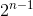

# The Deutsch Jozsa Algorithm

The Deutsch Jozsa algorithm is a really simple Quantum algorithm which can do something faster
than any classical computer can today! This page will try to explain the steps
concretely so you can see exactly **how and why it works**.

This document is similar to the [explanation in Wikipedia here](https://en.wikipedia.org/wiki/Deutsch%E2%80%93Jozsa_algorithm).
I will focus more on details which are assumed there, but you may want to read that article instead - whatever works for you!

#### Caution

Please read [the Maths of Simulating a Quantum Computer](TheMathsOfSimulatingAQuantumComputer) if you
are new to Quantum computing. Quantum algorithms are quite Mathematical so you will want to be
comfortable with the basics before proceeding!

## The Problem

We are given a function

which takes an `n` bit number and returns either a `0` or a `1`. We are told that the function is definitely either:

* **Balanced** - the function returns `1` for half of its inputs, and `0` for the other half.
* **Constant** - the function always returns `1` or always returns `0`.

Our goal is to determine if  is balanced or constant in time polynomial in `n`.

With a classical computer, we would need to check just over

inputs in the **absolute worst case**, as all the values could be the same for the first
 values we test even if the function were balanced
1.

However, a Quantum computer can solve this problem in polynomial time with certainty! This strongly suggests
that Quantum computers are able to solve more problems efficiently than classical computers
2.

1By choosing
 at random it is extremely
likely we will identify that  is balanced, and so could guess it is
constant if we do not see different return values quickly. This problem is actually in **Bounded error Probabilistic
Polynomial Time**, or <a href="https://en.wikipedia.org/wiki/BPP_(complexity)">BPP which you can read about here</a>. 
2 Quantum computers have not been **proven** to be more powerful
than classical computers in a complexitly class sense. However, most scientists believe this to be the case. In fact,
a proof might be online since I wrote this!

## Building the Quantum Oracle

The Deutsch Jozsa algorithm relies on a "quantum" version of 
called an **Oracle**, which we will refer to as
.
Specifically, the Deutsch Jozsa algorithm requires that:

Where 
and 
and  addition modulo two.

So 
leaves all of the first `n` **input qubits** untouched, and sets its **result** in the `n+1` qubit by adding its return
value to it modulo `2`.

#### Why this Oracle specifically?

Many classical functions **avoid modifying their input**, as this can create **unintended side effects**
if the input is reused in a future call, and in our case would seriously complicate the Maths! We are not trying to
minimise the number of qubits required here, so that decides most of the Oracle already:

So how should we set the result? Any Quantum gate needs to be a **Unitary matrix** and so needs to be **reversible**,
so trying to define it like this:

Is not possible, since the value of  is ignored.
Two inputs are mapped to the same output, which cannot be reversed, so this is not a valid Quantum gate.

The next simplest definition is to add the result to 
modulo two. This ensures:
* The result **fits in a single qubit**.
* The operation is **reversible**, since the result is uniquely determined by  and
.

We could imagine calling 
with  set to zero, and so just see the result returned. This
is roughly why this is a good definition for the Oracle, and you may see this sort of definition in other
Quantum algorithms too.

This may not reflect the thoughts that went through David Deutsch's and Richard Jozsa's minds but I hope it helped
your understanding!

#### How is the Oracle represented Mathematically?

From the reasoning above, I hope you feel confident a quantum gate exists for
,
but what does this gate look like?

We know that for any qubit state  we can write that state
as a linear combination of basis vectors. So, for `n` qubits, we could write a qubit state like this:

Where  and

for all .1 Therefore, when we apply
 to
 we can write that as follows:

What this means is that our Oracle's behaviour is completely defined by how it acts on the basis states, or in other
words, agreeing on the value of

for all  **completely and uniquely defines the Oracle**! This is great news, because we know
exactly how we want our Oracle to behave on the basis states.

For example, with `n` equal to two qubits, and  a constant function
that always returns `1`, our Oracle would be:

I've labelled the rows and columns to correspond to the basis states. For example, the row labelled `000` will act
on the basis state ,
and set it to the basis state in the column with a `1`, in this case
. This is correct,
since we have 
and  so:

You can verify some other values if you like; they should all work!

In general, any Oracle can be constructed from a classical function
in this way, where each row contains the scalars

corresponding to the **basis state decomposition of the result**. In our case,
each result is exactly a single basis state so the rows are very simple.

1This is specifically for our matrix representation, but we could
also write this in Dirac notation. This law is not specific to matrices or vectors.

## Resources

Some useful resources I found while learning about Quantum Computing:
* https://en.wikipedia.org/wiki/Deutsch%E2%80%93Jozsa_algorithm - Deutsch Jozsa algorithm.
* https://en.wikipedia.org/wiki/BPP_(complexity) - Bounded error Probabilistic Polynomial time or BPP.