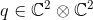
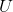
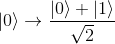
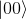
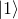

# Quantum Simulation

This project was going to just try and simulate a quantum computer for a limited number of qubits.

However, having learnt* the basics of Quantum computing in terms of complex numbers, tensor products and unitary
matrices, it seems like trying to provide a way to write quantum algorithms with these traditional constructs
might be confusing...

So I'm looking for a way to express Quantum algorithms more intuitively.
 *Something anyway!!

Throughout this README please forgive me for my haphazard method of showing equations in Markdown!

## The Maths of simulating a Quantum Computer

I believe the executive summary of simulating a quantum computer is this.

### Representing a Qubit

A single qubit can be represented as , where 
 is the set of all complex numbers. However, there is a restriction:

Where  is the conjugate transpose. Why does this restriction
exist? It corresponds to the **sum of the probability** of the qubit being measured in each state with respect
to a basis. Since it must be in one state after measurement, the probabilities should sum to one.

Measurement usually corresponds to getting some classical1 bit from a qubit. That is, looking at the qubit and
deciding if it is 0 or 1. But a qubit can be in a **superposition** between the states 0 and 1, or in other words
somewhere inbetween 0 and 1.

In our space for a qubit , we define the **computational basis** vectors
as  and
.2
These correspond to the classical bits 0 and 1. Since these are basis vectors, any other vector in 
can be written as a linear combination of these vectors, so:

with 

Our previous restriction on our qubit requires that
.
As you might guess, these correspond to probabilities!

*  is the probability the qubit is 0 when measured.
*  is the probability the qubit is 1 when measured.

Something odd happens after measurement; the qubit actually **becomes the state measured**! If you measured it again,
it would still be in the same state with 100% probability. The superposition is lost or in technical jargon,
the **wave function collapsed**. This is a problem, as it means you can only look at your qubit once in some sense
before having to start the algorithm again.

1Classical throughout this document just refers to the computers we use today - normal computers. 
2The angular brackets is called Dirac or Bra-Ket notation.

### Representing lots of Qubits

Multiple qubits are represented as members of the vector space formed by the **tensor product**1 of vector spaces for individual
qubits.

For example, two qubits together can be represented as . The tensor
product here can be computed as the **Kronecker product**2, so two qubits can be written as a vector in .

The computational basis vectors for two qubits are simply:

If you measured these qubits, you would get `00`, `01`, `10`, or `11` with probabilities corresponding
to the amplitude squared of the components in the vector, so for:

We have that:
* 
*  is the probability we measure `00`.
*  is the probability we measure `01`.
*  is the probability we measure `10`.
*  is the probability we measure `11`.

This representation extends to `n` qubits as you would expect, but keep in mind the resulting vector space is
. Therefore, you need an exponential amount of space and time to
simulate qubits on a classical computer, at least through this simple approach.

1Tensors are members of a tensor space which is the tensor product of vector spaces. They are related
to multilinear maps. That might sound scary, but
[this article does a fantastic job of explaining them](https://jeremykun.com/2014/01/17/how-to-conquer-tensorphobia/). 
2The Kronecker product is a way of calculating the tensor product with traditional matrices (w.r.t a specific basis). Since
tensors can have a rank greater than 2 representing higher dimensions than a matrix, matrices produced via the Kronecker Product
grow exponentially in size! [See this Wikipedia article for details](https://en.wikipedia.org/wiki/Kronecker_product). 

### What are Quantum Gates?

So now we have our qubits, what can we do with them? The simple answer is that we can multiply the matrix
representation of our qubits by **any unitary matrix**1. A unitary matrix has a couple of important properties:

#### Invertible

All unitary matrices are **invertible**. Specifically, their conjugate transpose is their
inverse or in other words for  a unitary matrix:

This means anything you do to your quantum bits, besides measurement, **should be reversible**.

For example, an operation that just sets all qubits to zero is not possible because:
given all zero qubits, how would you know what the qubits were previously?

#### Preserve Inner Product

All unitary matrices will preserve the inner product, which is also known as the **norm**.
That is to say:

This is really important, as it means the probability of each possible state measured
**still sums to one** so you can never for example, see a 150% chance of measuring a one in the Maths.
There is no need to normalise the qubits after applying unitary matrices.

That is strictly all there is to Quantum gates, but knowing which ones to use is not easy.
A number of example gates can be [found on Wikipedia](https://en.wikipedia.org/wiki/Quantum_logic_gate).

1A unitary matrix is just a matrix whose conjugate transpose is its inverse. For
details [see this Wikipedia article](https://en.wikipedia.org/wiki/Unitary_matrix).

### Combining Quantum Gates

Suppose you would like to apply a Hadamard gate1 to the first qubit but not the second.
The simplest way to do this is to take the Kronecker product of the Hadamard matrix with the Identity matrix,
and apply that. The equation works out like this:

You could also create a quantum gate to apply the Hadamard gate to two qubits just by calculating
.

The above holds for `n` qubits as well, since the tensor product of linear maps (or in other words
unitary matrices) is also a linear map. See
["Tensor Product of Linear maps" on this page](https://en.wikipedia.org/wiki/Tensor_product#Tensor_product_of_linear_maps).

1A Hadamard gate is just this unitary matrix:

It is very useful as it maps the basis states to equal superpositions of those states.

</img>&nbsp;
and &nbsp; </img>

In other words, it turns a 1 or 0 into something that is sort of both 1 and 0 at the same time -
it could be 1 or 0 with equal probability.

### Where does Entanglement come in?

Quantum entanglement is what happens when the state of one qubit affects some number of other qubits. The qubits
can no longer be said to behave independently. An example of an entangled state is any of the **Bell States**1,
such as this one:

Note that this Bell state does not include

or .
This means if we measured both qubits, the qubits would **always have the same value**, they would either
both be `0` or both be `1`. In this way, the qubits are **entangled**2.

Using just unitary matrices, you can form this Bell state starting from the pure state3

as follows4:

So you really do have the ability to weild quantum algorithms with just unitary matrices!

1The Bell states are all maximally entangled states. There are four for a single qubit,
but the pattern can be extended to `n` qubits fairly easily.
[You can find out more here](https://www.quantiki.org/wiki/bell-state). 
2To illustrate, if Alice were given one of the two qubits in this Bell state and travelled to Proxima Centauri,
while Bob were given the other qubit and stayed on Earth, when Alice measures her qubit and sees a `1`, it
is guaranteed that whenever Bob measures his qubit, it will also appear to be `1`.

This is true even if Bob measures his qubit **before light could travel to him after Alice measured her qubit**, and it is also
known to be true that when Alice measured her qubit, the result was truly random - the qubits had not
predetermined their value. This is referred to as **Quantum non-locality**.

This non-locality is, amazingly, provable and was shown by John Bell.
[You can read about it here](https://en.wikipedia.org/wiki/Quantum_nonlocality). The proof
relies on the fact **you can measure in different bases** (not just in
,
), and the choice of basis by Alice
affects the measurement made by Bob (in his choice of basis) in a way that cannot be predetermined by a
**Hidden Local Variable** (HLV). 
3Any quantum state that is not entangled is said to be a **pure state**. This also corresponds
exactly to a **rank 1 tensor**. Qubit states represented by rank 2 or more tensors are entangled. 
4The Controlled NOT gate, CNOT, is defined as:

### Measuring Qubits

Mathematically a measurement is represented a linear, not unitary matrix.

## What is a Quantum Algorithm

In looking into this

## Resources

Some useful resources I found while learning about Quantum Computing:
* https://en.wikipedia.org/wiki/Qubit - what is a qubit.
* https://www.quantiki.org/wiki/basic-concepts-quantum-computation - basic concepts
* https://jeremykun.com/2014/01/17/how-to-conquer-tensorphobia/ - tensors and tensor products.
  * All of Jeremy Kun's articles on quantum computers are a good read too.
* https://en.wikipedia.org/wiki/Kronecker_product - Kronecker product.
* https://en.wikipedia.org/wiki/Unitary_matrix - Unitary matrix.
* https://en.wikipedia.org/wiki/Quantum_logic_gate - example gates.
* https://en.wikipedia.org/wiki/Tensor_product - Tensor product.
* https://www.quantiki.org/wiki/bell-state - Bell states.
* https://en.wikipedia.org/wiki/Quantum_nonlocality - Quantum non-locality.
* https://physics.stackexchange.com/questions/3390/can-anybody-provide-a-simple-example-of-a-quantum-computer-algorithm - intuitive
explanations for Deutsch's and Grover's algorithms.
* https://www.scottaaronson.com/blog/?p=208 - intuitive explanation for Shor's algorithm.